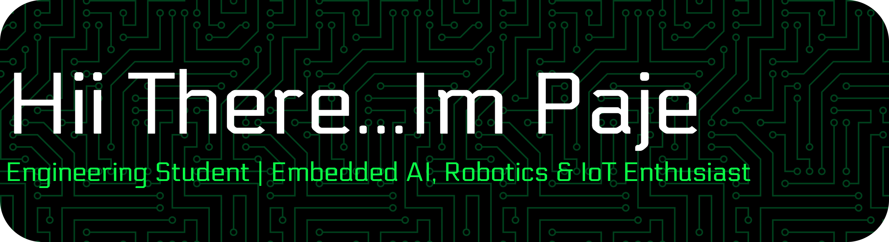

## Hi there 👋

# Hi, I'm Muhammad Fajrin Aslam 👋
You can call me Paje. I'm an Informatics Engineering student at 
[Universitas Dipa Makassar](https://site.undipa.ac.id/), Indonesia.//

I enjoy tinkering with robotics and IoT projects, exploring numbers and computation, and understanding how hardware and software work together. I'm interested in studying artificial intelligence more deeply, especially deep learning and its applications in physical devices.

## My Interests

- Artificial intelligence and deep learning
- Robotics and Internet of Things (IoT)
- Embedded systems, Edge AI, and TinyML
- Mathematics and computational problem-solving
- Assistive technology

## Current Project: Smart Glove

I'm developing an ESP32-based smart glove for recognizing selected gestures from SIBI (Sistem Isyarat Bahasa Indonesia).

The project explores flex sensors and motion sensing, with the goal of running gesture recognition on the device and providing voice output and vibration feedback.

Through this project, I'm learning about sensor calibration, data collection, model development, and the challenges of connecting software with real hardware.

## Learning Goals

- Strengthen my Python programming and mathematical foundations.
- Develop a deeper understanding of machine learning and deep learning.
- Explore how AI models can run on devices with limited resources.
- Build well-documented projects that support my preparation for graduate study in AI.

I learn by experimenting, asking questions, troubleshooting, and improving my projects step by step.

<h3>Tools & Technologies</h3>

  
  
  
  
  
  
  
  
  
  
  

##### Connect With Me

